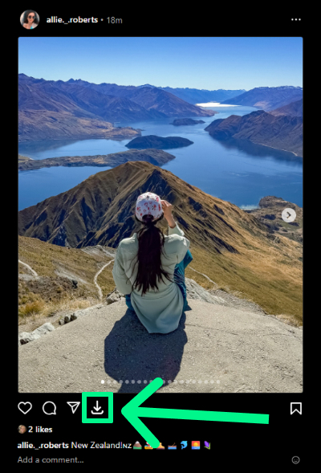
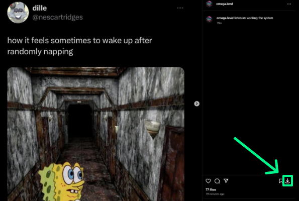

# instayoink
Browser extension which adds a download button for images and videos on Instagram and Threads

### Screenshots

### Dependencies

-  [dayjs](https://github.com/iamkun/dayjs/) ([MIT License](https://github.com/iamkun/dayjs/blob/dev/LICENSE))
-  [React](https://github.com/facebook/react) ([MIT License](https://github.com/facebook/react/blob/main/LICENSE))

### Licensing

The source code is licensed under MIT. License is available [here](/LICENSE).
